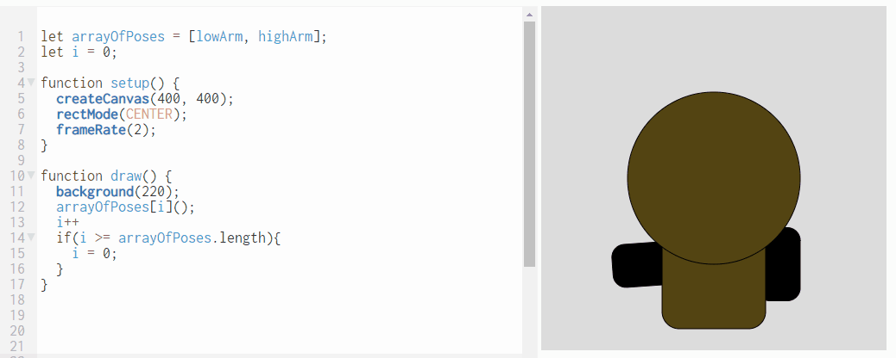

Animate An Array of Poses     
-------------------------

In this lab you will create two or more functions that have a character in various poses. You can use your Kawaii character or create a new one. In this sample program, I've created two poses for my Kawaii character, one with a low arm and one with a high arm. I store all the poses in an array. Then, each time I draw the screen I go to the next pose. When I reach the end of the array, I start again from the beginning.   
   
Samples of Student Work
-----------------------
none yet!
