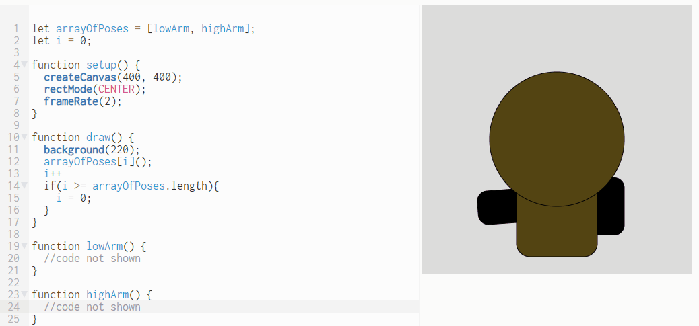

Animate An Array of Poses     
===========================

In this lab you will create two or more functions that have a character in various poses. You can use your Kawaii character or create a new one. In this sample program, there two functions that each store a pose for a Kawaii character; one with a low arm and one with a high arm. All the poses are stored in an array named `arrayOfPoses`. Then, each time the screen is drawn the variable `i` is incremented to the next pose. When the end of the array is reached, `i` is set to zero to restart the series of poses.   
   

Samples of Student Work
-----------------------
none yet!
